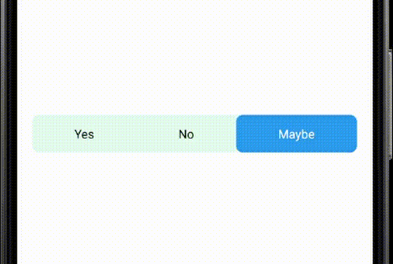

[](https://www.android.com)
 [](https://jitpack.io/#Saif-al-islam/SlideCounter-Android)
 []()

**SingleChoiceView** - An Android library that can be used for select item from many items in a row/column.

## Sample


## Usage

### step 1

Include the library as a local library project or add the dependency in your build.gradle.

```groovy
dependencies {
	   implementation 'com.github.Saif-al-islam:SingleChoiceView:1.0.0'
	}
```

Add it in your root build.gradle.

```groovy
allprojects {
		repositories {
			maven { url 'https://jitpack.io' }
		}
	}
```

### Step 2

Include the SingleChoiceView in your layout. And you can customize it like this.

```xml
    <com.saif.singlechoiceview.SingleChoiceView
        android:id="@+id/single_choice"
        android:layout_width="match_parent"
        android:layout_height="wrap_content"
        android:layout_gravity="center"
        android:layout_margin="18dp"
        android:paddingVertical="12dp"
        app:SelectedTextColor="#ffffff"
        app:selectedIndex="0"
        android:background="@drawable/rect_corner"
        app:selectionBckColor="#2196F3"
        app:selectionBckCorner="8dp"
        app:unSelectedTextColor="#000000">

        <TextView
            android:layout_width="wrap_content"
            android:layout_height="wrap_content"
            android:layout_weight="1"
            android:text="Yes"
            android:textAlignment="center" />

        <TextView
            android:layout_width="wrap_content"
            android:layout_height="wrap_content"
            android:layout_weight="1"
            android:text="No"
            android:textAlignment="center" />

        <TextView
            android:layout_width="wrap_content"
            android:layout_height="wrap_content"
            android:layout_weight="1"
            android:text="Maybe"
            android:textAlignment="center" />

    </com.saif.singlechoiceview.SingleChoiceView>
```

## XML Attributes Description

|name|format|description|
|:---:|:---:|:---:|
| SelectedTextColor | color | text color of selected item.
| unSelectedTextColor | color | text color of unSelected item.
| selectedIndex | integer | Index of init selected item (it's zero index), default is 0
| selectionBckColor | color | bacground color of selected item.
| selectionBckCorner | dimens | radius corner of selected item's background shape.


## Code Attribute Description

All the attribute of the xml can be changed throw the Java/Kotlin code in addition to:

|name|parameters|description|
|:---:|:---:|:---:|
| OnSelectionChangeListener | selectionIndex: Int, selectedId: Int? | This Function is called every time the user click item.


